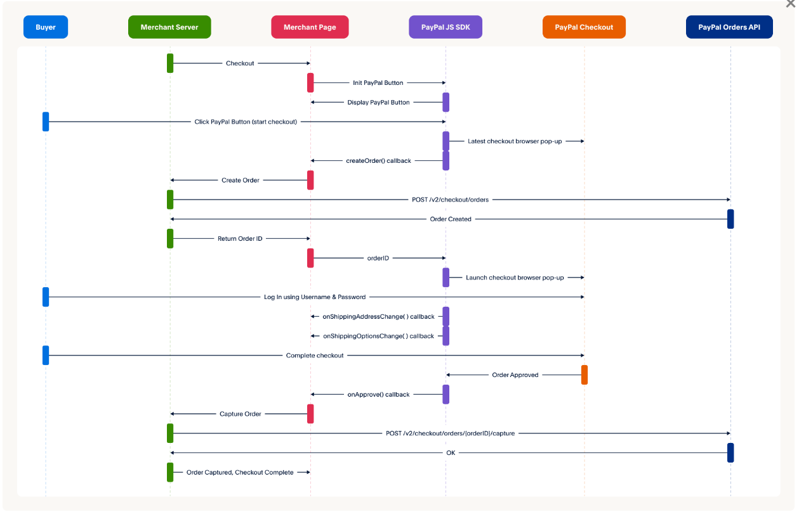

## Create Layout
- Import layout from htmlcodex.com into directon wwwroot
- Create RazorLayout _LayoutCustomer
- Create RazorView _Footer
- Sử dụng @await Html.PartialAsync("_Footer"); để gọi Footer trong LayoutCustomer

## Tạo Menu hàng hóa
- Tạo thư mục ViewComponets với ViewModels
- Tạo class MenuLoaiVM trong ViewModels, MenuLoaiViewComponet trong ViewComponets
- Tạo Views/Shared/Components/MenuLoai để hiện view về MenuLoai
- Sử dụng @await Component.InvokeAsync("MenuLoai") để gọi Default.cshtml 

## Trang Danh sách hàng hóa
- Tạo layout _DanhSachHangHoa
- Sử dụng RenderSection trong layout _DanhSachHangHoa 
- Chỉnh sửa code trong view của action index của controller HangHoa
- Tạo action Search của controller HangHoa
- Thêm chức năng tìm kiếm và modal trong _LayoutCustomer

## Chi tiết hàng hóa
- Tạo view ProductItem of controller HangHoa để xem danh sách sản phẩm
- Import ProductItem vào view action Index và Search of controller HangHoa
- Tạo class DetailHangHoaVM
- Tạo view Detail and action Detail of controller HangHoa
- Tạo Layout _SearchPanel và import vào _DanhSachHoangHoa và view Detail of controller HangHoa

## Đưa hàng vào giỏ
- Sử dụng Session and state management in ASP.NET Core 
- Xây dựng method extenxion (Tạo static class SessionExtensions) cho session
- Tạo ViewModel CartItemVM and Controller CartController
- Xây dựng action and view Index cho CartController
- Xây dựng action Add and Remove để redirect to action Index trong CartController

## Thông tin Giỏ hàng
- Tạo class MyConst để lưu trữ các const trong folder Utils
- Tạo class CartModel trong ViewModels
- Tạo class CartViewComponet trong ViewComponets
- Tạo view cho hàm Invoke của CartViewComponet
- Import view này vào _LayoutCustomer

## Chức năng Đăng ký Thành viên
* Tạo class RegisterVM trong ViewModels
* Tạo class KhachHangController and View Register của nó
* Tạo class MySetting trong Utils để lưu trữ các chức năng bổ sung như tạo Key Random khi người dùng đăng kí, upload file image
* Sử dụng AutoMapper để chuyển đổi dữ liệu giữa 2 object
    * Tạo class AutoMapperProfile kế thừa từ class Profile
    
        Sử dụng method CreateMap

        Nếu thuộc tính trong object src and dest không cùng tên thì dùng method ForMember để config
    * Đăng kí service AddAutoMapper
* Tạo class DataEncryptionExtensions trong Utils để mã hóa mật khẩu

## Chức năng Đăng nhập
* Fix action Register (kiểm tra sự tồn tại Khách hàng trước khi gửi)
* Tạo class LoginVM trong ViewModels
* Tạo view và action Login cho KhachHangController
* Add cookie authentication
* Trong action Login: Create an authentication cookie (Sử dụng ClaimsPrincipal и объекты Claim)
* Tạo view và action Profile cho KhachHangController (sử dụng Authorize)
* Tạo action Logout cho KhachHangController (sử dụng Authorize)

## Chức năng Thanh toán COD
* Thêm cột DienThoai cho table HoaDon, chỉnh sửa lại class HoaDon và HShopContext
* Tạo Action [HttpGet] and View Checkout cho CartController
* Tạo class CheckoutVM
* Tạo Action [HttpPost] Checkout và đặt lại giá trị session lưu trữ giá trị giỏ hàng sau khi checkout
* Tạo View success cho CartController để xác nhận hoàn thành checkout

## Chức năng Thanh toán PAYPAL
* Chuẩn bị:
    * Đăng ký tài khoản Paypal
    * Vào https://developer.paypal.com/
    * Tạo tài khoản sandbox để demo: Sandbox accounts - PayPal Developer (gồm 2 loại Personal - người mua, Business - người bán)
    * Tạo mới App ở mục Apps & Credentials Applications - PayPal Developer hoặc đứng ngay trong tài khoản Business để tạo.
    Sau đó copy App ID, App secret key để dành để thêm vào project.
    * Tham khảo: https://developer.paypal.com/sdk/js
* Sơ đồ biểu thị quá trình checkout

    
* Thêm vào file appsettings.json thông tin PaypalOptions(ClientId, ClientSecret,Mode)
* Tạo class PaypalClient chứa các method (Authenticate, CreateOrder, CaptureOrder) và các class liên quan đến đối tượng.

    Links: [REST APIs][apis], [Integrate Checkout][checkout]

    [apis]: https://developer.paypal.com/api/rest/

    [checkout]: https://developer.paypal.com/studio/checkout/standard/integrate
* Inject service PaypalClient in program.cs
* Gán cho ViewBag.PaypalClientId trong action HttpGet Checkout in CartController
* Trong view Checkout của CartController:
    * [Add the SDK](https://developer.paypal.com/sdk/js/configuration/)
    * Tạo thẻ div có id = paypal-button-container
    * [JavaScript SDK reference](https://developer.paypal.com/sdk/js/reference/): sử dụng paypal.Buttons(options)
* Tạo region Paypal payment gồm 2 action HttpPost chính CreatePaypalOrder và CapturePaypalOrder trong CartController